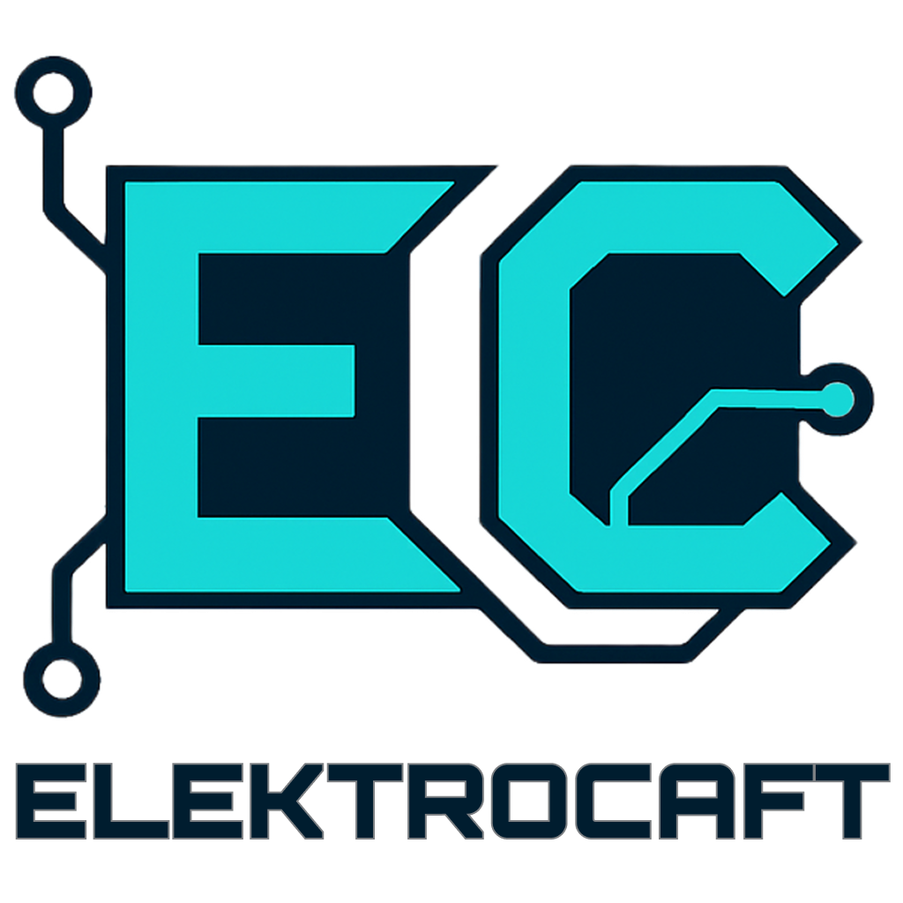

# ElektroCraft ⚡  

**ElektroCraft** adds realistic electronics and electrical engineering to Minecraft. Build circuits with resistors, transistors, and generators, following real-world physics. Manage voltage, power transmission, and automation to create advanced electrical networks while integrating seamlessly into Minecraft’s block-based world.  

## 🚀 Features  
- **Electronic components**: Resistors, transistors, capacitors, diodes, and more.  
- **Power generation**: Solar panels, wind turbines, batteries, and traditional generators.  
- **Realistic energy transmission**: Voltage drops, current flow, efficiency loss, and resistance calculations.  
- **Cable types**: Various conductors with different resistances and transmission efficiencies.  
- **Automation & logic gates**: Advanced engineering possibilities with digital circuits.  
- **Interactive circuit-building**: Assemble systems with intuitive UI and simulation.  
- **Device integration**: Custom machines that operate based on electrical signals.  
- **Energy storage**: Capacitors and batteries for stable power management.  

## 🔧 Installation  
1. Download the latest **ElektroCraft** release from [GitHub](https://github.com/RGerva/ElektroCraft).  
2. Install **Minecraft Forge** (latest stable version).  
3. Place the ElektroCraft `.jar` file into the `/mods` folder.  
4. Launch Minecraft and start experimenting with **realistic electronics**!  

## 📜 License  
This project is licensed under the **Apache License 2.0** – see the [`LICENSE`](https://github.com/RGerva/ElektroCraft/blob/master/LICENSE) file for details.  

## 🛠 Requirements  
- **Minecraft Version**: 1.21.5+  
- **Forge Version**: Latest stable release  
- **Minimum RAM**: 4GB (recommended for complex circuits)  
- **GPU & CPU**: No special requirements beyond standard Minecraft mod performance  

## 🔍 How It Works  
ElektroCraft brings **real-world physics** into Minecraft’s electrical system! Here’s how key mechanics function:  
- **Voltage and Current**: Components affect how electricity flows through circuits.  
- **Resistors**: Lower current by increasing resistance, affecting voltage levels.  
- **Transistors**: Act as switches/amplifiers for complex logic operations.  
- **Generators**: Produce electricity with realistic efficiency and consumption rates.  
- **Energy Storage**: Batteries and capacitors store energy for regulated distribution.  
- **Wires & Conductors**: Different materials affect transmission loss and power efficiency.  

## 🎮 Commands & Configuration  
| Command | Function |  
|---------|----------|  
| `/elektrocraft debug` | Shows circuit debug info |  
| `/elektrocraft reload` | Reloads mod configurations |  
| `/elektrocraft powercheck [x]` | Checks power flow at a specific coordinate |  
| `/elektrocraft simulate` | Runs a full circuit simulation |  

---  

🚀 **Stay tuned for updates!** ⚡
